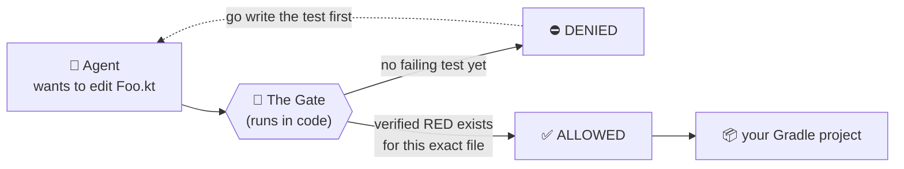
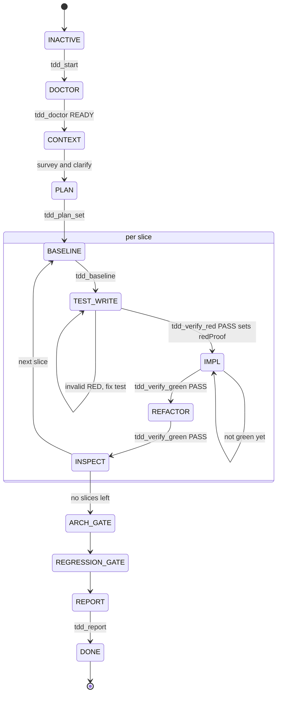
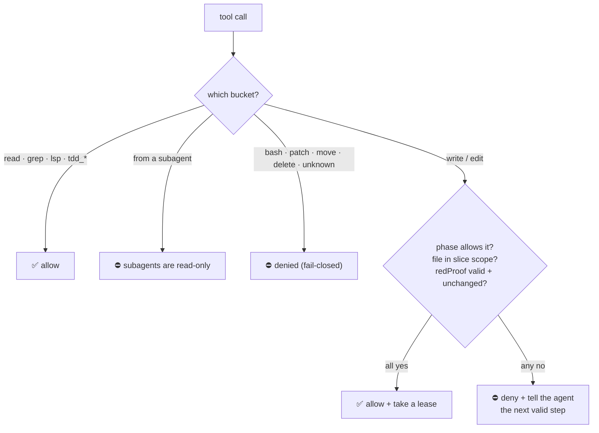
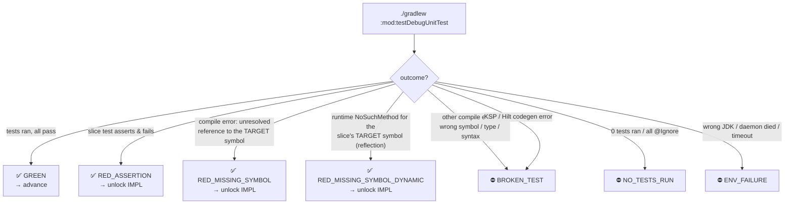
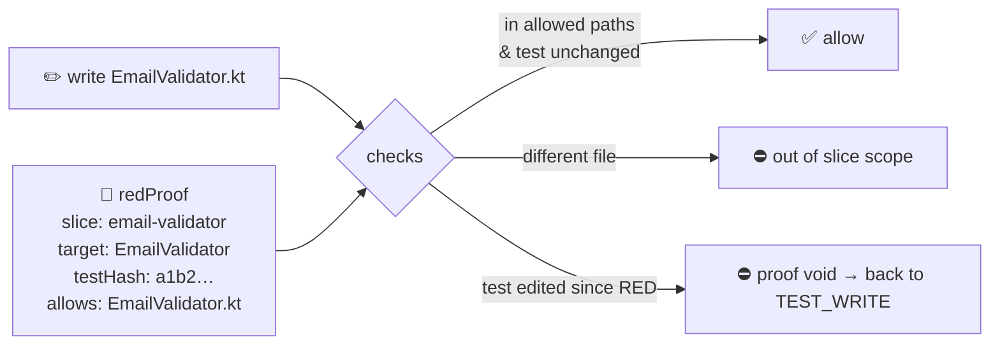
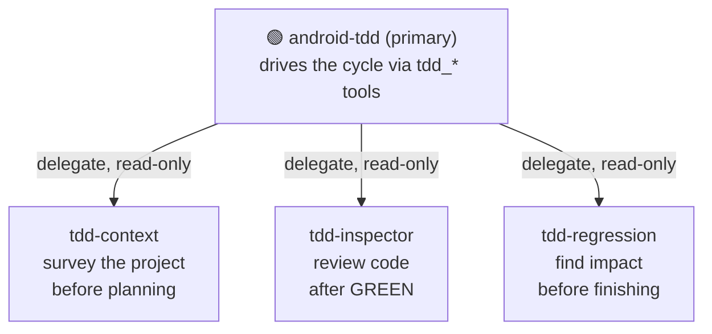

# opencode-android-tdd

> **A Test-Driven Development gate for Android/Kotlin — enforced in code, not in a prompt.**
> Your AI agent *physically cannot* write production code until a real failing test exists.

[](https://github.com/milad9005/opencode-android-tdd)
[](./LICENSE)
[](https://opencode.ai)

---

## 30-second pitch

When you tell an AI agent "use TDD," it *says* it will — then writes the code first and
backfills a test that passes. Prompts don't hold under pressure.

This [OpenCode](https://opencode.ai) plugin makes TDD **non-negotiable**. It sits between
the model and your files as a gate written in code. The rule it enforces:

> **No production code may be written until a test exists that fails for the right reason —
> verified by actually running Gradle.**

The model still does the work (planning, writing tests, implementing). It just can't cheat
the order, because the gate isn't something it can talk its way past.



---

## See it in action

You talk to the `android-tdd` agent like normal. Behind the scenes it's forced through the
Red → Green → Refactor loop:

```text
You ▸ Add an email-format validator to :feature:register

agent ▸ tdd_start            ✓ workflow begun
agent ▸ tdd_doctor           ✓ JDK 21 found, :feature:register is supported
agent ▸ tdd_plan_set         ✓ 1 slice: "EmailValidator" (1 test file, 1 prod file)
agent ▸ tdd_baseline         ✓ no pre-existing failures
agent ▸ (writes EmailValidatorTest.kt)        ← test files only; prod edits DENIED here
agent ▸ tdd_verify_red       ✓ RED_MISSING_SYMBOL  → IMPL unlocked for EmailValidator.kt
agent ▸ (writes EmailValidator.kt)            ← now allowed, ONLY this file
agent ▸ tdd_verify_green     ✓ GREEN            → REFACTOR
agent ▸ tdd_verify_green     ✓ still GREEN      → INSPECT
agent ▸ tdd_report           ✓ done
```

If the agent tries to write `EmailValidator.kt` *before* `tdd_verify_red`, the gate throws
and tells it exactly what to do next. It cannot proceed.

---

## Install (2 minutes)

**Prerequisite:** a JDK with `javac` (a JRE-only `JAVA_HOME` won't compile — the plugin
auto-detects a real JDK, including Android Studio's bundled JBR).

```jsonc
// opencode.json  — from npm…
{ "plugin": ["opencode-android-tdd"] }

// …or straight from GitHub (no npm needed)
{ "plugin": ["github:milad9005/opencode-android-tdd"] }
```

On first load it installs four agents once into your global `~/.config/opencode/agent/`
(never overwrites your edits), so the `android-tdd` agent is available in every project.
The gate stays dormant unless you actually select that agent, and `tdd_doctor` checks
per-project whether the module is a supported Gradle target at runtime. Then:

```bash
opencode --agent android-tdd
> Add an email validator to :feature:register
```

---

## How it works

Three pieces: a **state machine** (the cycle), a **gate** (the enforcer), and a
**classifier** (the judge).

### 1. The cycle — a state machine the model can't skip

The plugin owns the current phase. The model moves between phases only by calling `tdd_*`
tools, and each tool **proves** the transition by running Gradle — it can never just claim
success.



The key edge: **`TEST_WRITE → IMPL` requires `tdd_verify_red` to pass.** There is no other
way into `IMPL`, and `IMPL` is the only phase where production code can be written.

### 2. The gate — every tool call is filtered

The gate runs on OpenCode's `tool.execute.before` hook. It's an **allow-list**: a tool is
read-only, plugin-owned, a guarded write, or **denied by default**.



Why each rule exists:

- **`bash` is denied** so the model can't run `./gradlew` itself and self-report results —
  the plugin's classifier must be the *only* judge of pass/fail.
- **Subagents are read-only** so a delegated agent can't sidestep the gate.
- **Unknown tools fail closed** — new/MCP tools can't open a hole.
- A **lease** taken before the write and released after it closes the gap between "approved"
  and "actually written," so nothing changes underneath the decision.

### 3. The classifier — judging a RED honestly

The hard problem: on Kotlin, a missing class is a **compile error**, not an assertion
failure — so a naive "the build failed = good RED" check is fooled by a typo, a broken
import, or a Hilt/KSP codegen error. The classifier reads the *real* Gradle + Kotlin output
and **fails closed**:



Only the three `✅ RED_*` outcomes unlock production code. *Everything else is treated as
broken* — the gate would rather block you than accept a fake RED. The dynamic variant
handles a test that reflectively calls a not-yet-existing target method (a runtime
`NoSuchMethodException`), but only under strict anti-cheat guards: the missing member must
be the slice's own target class + an expected symbol, and the failure must be new vs
baseline. (This is validated against real output captured from a production Android app,
including a real Hilt `@Binds` codegen break — see
[`docs/SPIKE-red-classifier.md`](./docs/SPIKE-red-classifier.md).)

### What a verified RED unlocks (and how it expires)

A RED isn't a yes/no flag. It's a **proof bound to one slice and the hashes of that slice's
test files.** It unlocks *only* the production files that slice declared, and the moment
anything drifts, it's void:



So one failing test for `EmailValidator` lets you write `EmailValidator.kt` and nothing
else — and if you tweak the test afterward to make life easier, the proof drops and you're
back to square one. That's the anti-cheat.

---

## The agents

The plugin ships one orchestrator and three read-only specialists (auto-installed once into
your global `~/.config/opencode/agent/` on first load):



The orchestrator holds **no hardcoded architecture rules** — `tdd-context` reads your
project's actual conventions (MVVM/MVI, Hilt/Koin, Compose/XML, test stack) so the generated
code matches what you already have.

---

## Support matrix (v1)

| ✅ Supported | ⛔ Not yet — detected and refused, never mishandled |
|---|---|
| Single & multi-module Gradle | Kotlin Multiplatform source sets |
| JVM library modules (`test`) | Instrumented tests (`androidTest`) |
| Android unit tests (`testDebugUnitTest`) | Build flavors beyond the default `debug` variant |
| JUnit4/5, Robolectric, MockK, Turbine, Kotlin K1/K2 | Non-Gradle builds |

`tdd_doctor` reports `UNSUPPORTED` with the exact reason **before** any work starts — it
never silently does the wrong thing.

---

## Tool reference

| Tool | What it does |
|---|---|
| `tdd_start` | Begin a workflow |
| `tdd_doctor` | Check JDK + whether the module is supported |
| `tdd_status` | Show current phase / slice / proof |
| `tdd_plan_set` | Break work into small, scoped slices |
| `tdd_baseline` | Record pre-existing test failures |
| `tdd_run` | Run + classify the slice's tests (read-only) |
| `tdd_verify_red` | Prove a valid failing test → unlock IMPL |
| `tdd_verify_green` | Prove the tests pass → advance |
| `tdd_inspect_done` | Finish a slice, move to the next |
| `tdd_quality` | Run detekt / ktlint / lint |
| `tdd_arch_check` | Advisory architecture check (v1) |
| `tdd_allow_build_edit` | The only validated path to change a build file |
| `tdd_expand_scope` | Widen a slice (forces RED re-verification) |
| `tdd_abort_slice` · `tdd_reset_workflow` · `tdd_takeover_stale_lock` · `tdd_explain_block` | Recovery |
| `tdd_report` | Render the final development report |

---

## Development

```bash
npm install
npm run build      # tsc + copy agent .md into dist/
npm run spike      # build + run all validation harnesses
```

Design and validation notes live in [`docs/`](./docs):
[`SPEC-v2`](./docs/SPEC-v2.md) ·
[`SPIKE-red-classifier`](./docs/SPIKE-red-classifier.md) ·
[`DOCTOR`](./docs/DOCTOR.md) ·
[`ENFORCEMENT-CORE`](./docs/ENFORCEMENT-CORE.md) ·
[`GATE`](./docs/GATE.md) ·
[`TOOLS`](./docs/TOOLS.md) ·
[`HATCH-AND-AGENTS`](./docs/HATCH-AND-AGENTS.md) ·
[`E2E`](./docs/E2E.md)

## License

MIT
